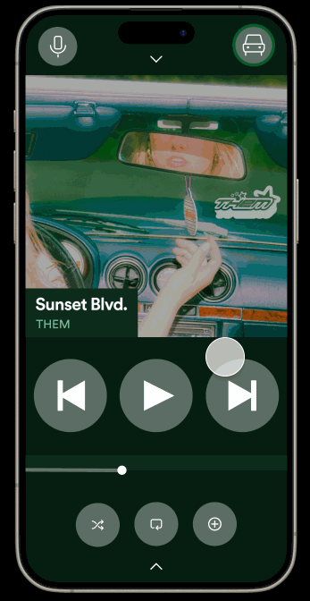
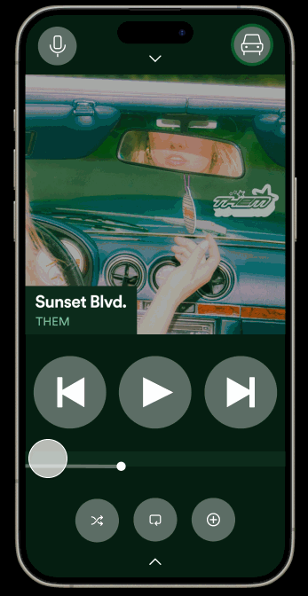
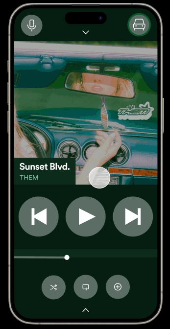
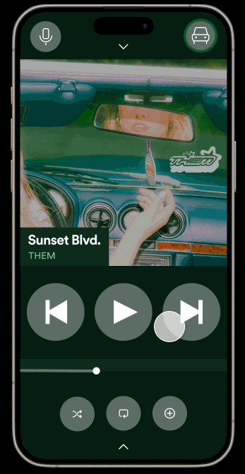
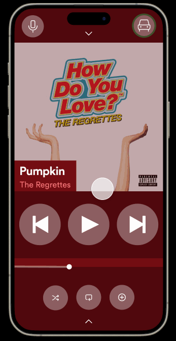
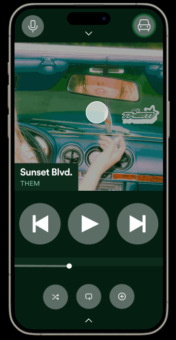
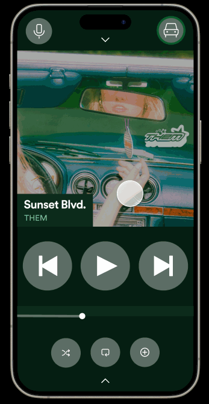

# So, I fixed Spotify's 'Car Mode'

  

## Overview
🎨✨ Introducing my all-new Spotify Car Mode experience, designed for drivers who demand more from their music on the move. Gone are the days of fiddly buttons and clunky navigation. Say hello to sleek designs, smooth transitions, and features that make your drive safer and more enjoyable.
## Background
- This study was undertaken as part of my [Human Computer Interaction](https://omscs.gatech.edu/cs-6750-human-computer-interaction) course at [Georgia Tech](https://omscs.gatech.edu/) 🐝.

- The goal was to understand user-based iterative design and execute the design life cycle to redesign an existing interface.
- Watch my [Video Walkthrough](https://www.youtube.com/watch?v=6i7qYM-bE3I&t=1s) where I compare my redesign with the current Car Mode.
- Join the ride. Try my [Figma Demo](https://www.figma.com/proto/cNwT22TWlyFrxmlst7Y6aJ/Car-Mode-Redesign?type=design&node-id=3-34&t=kr006QjXY8i8yJmk-0&scaling=scale-down&page-id=0:1&starting-point-node-id=3:34) now!
- Read about my [Findings](https://drive.google.com/file/d/1ZskA-IZHosi7VhiCdGMkSapGZk_yny7v/view?usp=sharing).
## Features  

### Revamped Interface  

  

   
I took the old Car Mode and gave it a full-body makeover, inside and out. The result? A user interface that's not just beautiful, but also smart and responsive. Because your focus should be on the road, not on pressing the right button.  

### Seamless Voice Integration

  

Whether you're a fan of shouting "Next!" at your stereo or whispering sweet nothings to change the track, enhanced voice controls are here to serve. They're so good; you might just start having conversations with them!  

### Hidden Features Treasure Trove

  

Discover the depths of your music library with my hidden tray functionality. It's like finding a secret compartment in your car but filled with your favorite artists and playlists!

### Enhanced Artist and Album Interaction

  

Delving deeper into your music collection has never been easier. I've refined the way you explore artists and albums in Car Mode, ensuring a more engaging and intuitive experience. Now, you can seamlessly navigate through an artist's discography, toggle between albums, singles, and EPs, and discover new tracks with just a few taps. 

  

This enhanced interaction not only enriches your music exploration but also keeps it straightforward and distraction-free while driving, maintaining safety as a top priority.

### Intuitive Controls

  

The simplified entry and exit process for Car Mode is a standout, enabling you to shift between modes with ease.  

 
 

  

Adaptive background screen interaction is a key feature, intuitively responding to your selections and commands, streamlining your experience.

## Final Remarks  
Ready to transform your mundane motor music into a symphonic road trip? Check out my project, take it for a spin, and see how I'm driving Spotify's Car Mode into the future. Feedback and backseat drivers are all welcome!

Don't just listen to music on the go—experience it with the all-new Spotify Car Mode. 🚀🎶
